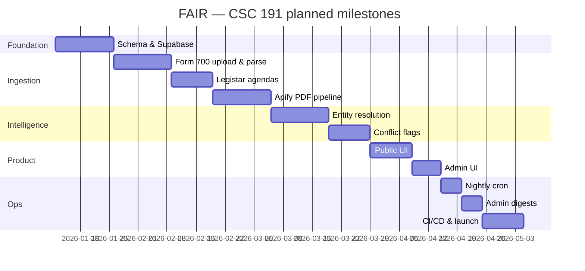

<p align="center">
  
</p>

<p align="center">
  <strong>Transparency at the intersection of public finance and local government.</strong>
</p>

<p align="center">
  
  
  
  
</p>

---

## Synopsis

**FAIR** (*Financial Accountability & Interest Review*) is a full-stack compliance platform built for the **California Fair Political Practices Commission (FPPC)**. It helps analysts and the public see when local officials’ **Form 700** financial disclosures may overlap with **city council agenda** items—surfacing potential conflicts of interest before votes happen.

The system ingests structured agenda data (**Legistar REST**), PDF-only city agendas (**Apify** + `pdf-parse`), and admin-uploaded **Form 700** spreadsheets (archived in **Supabase Storage**). Parsed entities are matched with **fuse.js**; ambiguous cases (fuzzy scores **0.7–0.85**) can be escalated to **Gemini 1.5 Flash**. Admins receive weekly digests via **Resend**; a **node-cron** job keeps data fresh overnight.

| Audience | Experience |
|----------|------------|
| **Public** | Browse officials, agendas, and flagged overlaps — no login required |
| **FPPC admins** | Upload Form 700 files, manage sources, review conflict flags — Supabase Auth (no public registration) |

---

## At a glance

<p align="center">
  
</p>

| Layer | Location | Hosting target |
|-------|----------|----------------|
| Frontend | `client/` | Vercel |
| API & jobs | `server/` | Railway |
| Database & storage | `supabase/` | Supabase (PostgreSQL + Storage) |
| Agenda helpers | `APIs/` | Scripts / cron orchestration |

> **Repo map:** start with [`CLAUDE.md`](CLAUDE.md) and [`DIRECTORY.md`](DIRECTORY.md) for task-specific context files.

---

## Data model (ERD)

Core relational model (seven tables) — full definition in [`server/prisma/schema.prisma`](server/prisma/schema.prisma):

<p align="center">
  
</p>

**Form 700 schedules** parsed from XLSX: **A** (investments), **B** (real estate), **C** (income), **D** (gifts), **E** (travel), **A-2** (business positions). See [`docs/fair/form700-ingestion/CONTEXT.md`](docs/fair/form700-ingestion/CONTEXT.md).

---

## Screenshots & prototypes

Add captures under `docs/assets/screenshots/` as the UI matures in CSC 191:

| View | File (add when ready) | Status |
|------|------------------------|--------|
| Public home / search | `docs/assets/screenshots/home.png` | _placeholder_ |
| Official profile + disclosures | `docs/assets/screenshots/official.png` | _placeholder_ |
| Agenda item + conflict flag | `docs/assets/screenshots/conflict.png` | _placeholder_ |
| Admin Form 700 upload | `docs/assets/screenshots/admin-upload.png` | _placeholder_ |

_Current scaffold — replace with real screenshots:_

```
client/app/routes/home.tsx          → public landing
client/app/routes/admin.login.tsx   → admin auth
client/app/routes/admin.sources.tsx → source management
```

---

## Repository layout

```
Senior-Project/
├── client/          # React Router 7 + Tailwind (public + admin UI)
├── server/          # Express API, parsers, Prisma, cron jobs
├── supabase/        # SQL migrations, Storage policies
├── APIs/            # Python / Legistar agenda helpers
├── docs/
│   ├── assets/      # README logos, ERD, architecture, screenshots
│   └── fair/        # Feature workspaces (ingestion, matching, cron, email)
├── .github/workflows/
└── CLAUDE.md        # Workspace map for contributors & agents
```

---

## Developer instructions

> **CSC 191 — placeholder.** Expand this section with full local-setup steps, env var matrix, and troubleshooting as the team finalizes the dev environment in class.

### Prerequisites (target stack)

- **Node.js** 20+
- **npm** (per-package lockfiles in `client/` and `server/`)
- **Supabase** project (Postgres + Storage + Auth)
- Optional: **Railway** CLI, **Vercel** CLI, **Apify** token, **Gemini** API key, **Resend** API key

### Quick start (draft)

```bash
# 1. Clone
git clone <your-repo-url>
cd Senior-Project

# 2. Backend
cd server
cp .env.example .env    # fill DATABASE_URL, DIRECT_URL, Supabase keys, etc.
npm install
npm run dev             # http://localhost:<PORT from src/index.js>

# 3. Frontend (separate terminal)
cd ../client
npm install
npm run dev             # Vite dev server (default port in terminal output)
```

### Branch workflow

| Branch | Purpose |
|--------|---------|
| `main` | Production-ready; deploys after CI |
| `dev` | Integration branch before merging to `main` |
| `feature/*` | Individual features / user stories |

### Environment variables

| Variable | Used by | Notes |
|----------|---------|-------|
| `DATABASE_URL` | Prisma / server | Supabase session pooler URI |
| `DIRECT_URL` | Prisma Migrate | Direct Postgres connection |
| `SUPABASE_*` | server, client | URL, anon key (client), service role (server only) |
| `APIFY_ACTOR_ID` | server | e.g. `fppc-csus~fair-agenda-pdf-scraper` |
| `GEMINI_API_KEY` | server | Entity resolution band only |
| `RESEND_API_KEY` | server | Weekly admin digests |

See [`server/.env.example`](server/.env.example) and area docs under [`docs/fair/`](docs/fair/README.md).

### _To complete in CSC 191_

- [ ] Document exact local ports and proxy rules between `client/` and `server/`
- [ ] Prisma migrate + seed instructions for fresh Supabase projects
- [ ] Supabase Storage bucket setup (`form700` uploads) — [`supabase/migrations/`](supabase/migrations/)
- [ ] One-command dev script or root `package.json` workspaces (optional)
- [ ] Contributor checklist (lint, typecheck, pre-push hooks)

---

## Testing

> **CSC 191 — placeholder.** Formalize coverage goals, CI gates, and manual QA scripts during the course.

### What exists today

| Area | Path | Notes |
|------|------|-------|
| Form 700 schedule parsers | `server/tests/unit/` | Schedules A, B, C/D/E |
| Legistar ingestion | `server/tests/integration/legistarIngestion.test.js` | Integration |
| Fixtures | `server/tests/fixtures/*.xlsx` | Valid + malformed samples |

```bash
cd server
npm test    # wire in package.json when Jest/Vitest runner is added
```

### _To complete in CSC 191_

- [ ] Add `npm test` script and document runner (Jest recommended; CI already expects it)
- [ ] Unit tests for Apify normalization and PDF text extraction
- [ ] Integration tests for fuse.js + Gemini resolution boundaries (0.7 / 0.85)
- [ ] E2E smoke tests for public browse and admin upload (Playwright or Cypress)
- [ ] Coverage threshold in [`.github/workflows/ci.yml`](.github/workflows/ci.yml)

---

## Deployment

> **CSC 191 — placeholder.** Production runbooks, secrets rotation, and rollback steps will be added as pipelines go live.

### Target topology

| Component | Platform | Trigger |
|-----------|----------|---------|
| `client/` | **Vercel** | Push to `main` (or preview on PR) |
| `server/` | **Railway** | CI deploy job on `main` |
| Database | **Supabase** | Migrations via Prisma / SQL in `supabase/migrations/` |

CI workflow: [`.github/workflows/ci.yml`](.github/workflows/ci.yml) — Postgres service, `prisma generate` + `prisma migrate deploy`, `npm test`, Railway `railway up` on push to `main`.

### _To complete in CSC 191_

- [ ] Vercel project linked to `client/` with env vars for API base URL
- [ ] Railway service + `RAILWAY_TOKEN` GitHub secret
- [ ] Supabase production vs staging projects documented
- [ ] `node-cron` schedule documented (timezone, idempotency, failure alerts)
- [ ] Post-deploy smoke checklist (health route, sample ingestion, admin login)

---

## CSC 191 timeline (JIRA backlog)

Planned delivery for **CSC 191** based on backlog user stories and story-point estimates. Sync keys and dates with your team board:

**JIRA board:** _[add your Atlassian project URL, e.g. `https://<team>.atlassian.net/jira/software/projects/FAIR`]_

| Week | Milestone | JIRA | User story (summary) | Est. |
|:----:|-----------|------|----------------------|-----:|
| 1–2 | **Foundation** | FAIR-1 | Supabase schema, Prisma models, RLS & Storage bucket for Form 700 | 8 |
| 2–3 | **Form 700 ingestion** | FAIR-2 | Admin XLSX upload, parse schedules A–E & A-2, persist filings | 13 |
| 3–4 | **Legistar agendas** | FAIR-3 | Pull meetings/agenda items/votes for Legistar cities; normalize shape | 8 |
| 4–5 | **PDF / Apify pipeline** | FAIR-4 | Apify actor for non-Legistar cities; PDF parse → agenda items | 13 |
| 5–6 | **Entity resolution** | FAIR-5 | fuse.js matching; Gemini only in 0.7–0.85 band; audit log | 13 |
| 6–7 | **Conflict detection** | FAIR-6 | Create/update `ConflictFlag` records; severity & status workflow | 8 |
| 7–8 | **Public UI** | FAIR-7 | Browse officials, agendas, flags; search & detail pages | 8 |
| 8 | **Admin UI** | FAIR-8 | Login, upload UI, source config, flag review queue | 8 |
| 9 | **Automation** | FAIR-9 | `node-cron` nightly sync; job monitoring | 5 |
| 9 | **Notifications** | FAIR-10 | Resend weekly digest for new/changed flags | 5 |
| 10 | **Ship** | FAIR-11 | CI/CD hardening, deployment, test pass, demo & docs | 8 |

**Total estimated:** ~97 story points across the term (adjust per sprint capacity).



_Update JIRA keys (`FAIR-*`) and calendar dates when your PO locks the 191 sprint schedule._

---

## Tech stack

| Concern | Choice |
|---------|--------|
| UI | React 19, React Router 7, Tailwind CSS 4, Vite |
| API | Node.js, Express 4 |
| ORM / DB | Prisma, PostgreSQL (Supabase) |
| Auth & files | Supabase Auth (admin only), Supabase Storage |
| Agendas | Legistar REST, Apify, `pdf-parse` |
| Form 700 | SheetJS `xlsx` |
| Matching | `fuse.js`, Gemini 1.5 Flash (ambiguous band) |
| Email | Resend |
| Jobs | `node-cron` (no Redis/BullMQ) |

---

## Documentation index

| Topic | Doc |
|-------|-----|
| Form 700 | [`docs/fair/form700-ingestion/CONTEXT.md`](docs/fair/form700-ingestion/CONTEXT.md) |
| Agendas | [`docs/fair/agenda-ingestion/CONTEXT.md`](docs/fair/agenda-ingestion/CONTEXT.md) |
| Entity resolution | [`docs/fair/entity-resolution/CONTEXT.md`](docs/fair/entity-resolution/CONTEXT.md) |
| Cron jobs | [`docs/fair/cron-jobs/CONTEXT.md`](docs/fair/cron-jobs/CONTEXT.md) |
| Admin email | [`docs/fair/admin-notifications/CONTEXT.md`](docs/fair/admin-notifications/CONTEXT.md) |

---

## Team & license

| | |
|---|---|
| **Course** | CSC 191 — Senior Project |
| **Sponsor** | California FPPC |
| **Repository** | `Senior-Project` (Sac State senior design) |

_License and contribution guidelines — to be added in CSC 191._

---

<p align="center">
  <sub>Built with accountability in mind — because public trust deserves more than manual spreadsheet cross-checks.</sub>
</p>
